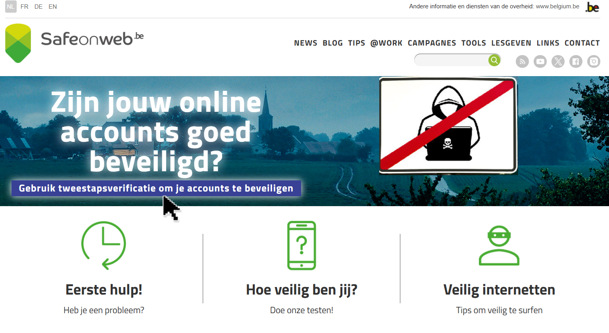
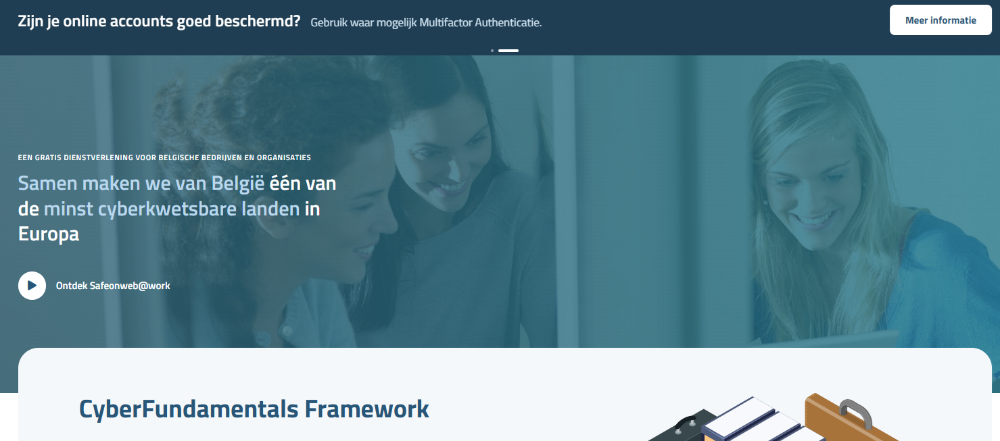

# SafeOnWeb

De Belgische overheid heeft in dit kader [het Cybersecurity Center Belgium (CCB)](https://ccb.belgium.be/nl) opgericht die instaat voor de definitie, sensibilisatie, opleiding en opvolging van de Cybersecurity bij particulieren en bedrijven in België. 

Via de [website](https://safeonweb.be) https://safeonweb.be kan je heel wat informatie vinden terug zowel voor particulieren (safeonweb@home) als voor bedrijven (safeonweb@work). 

## SafeOnWeb@Home

Safeonweb is een reeks diensten die het Centrum voor Cybersecurity België aanbiedt aan de hele Belgische bevolking. Safeonweb wil Belgische burgers snel en accuraat informeren en adviseren over cyberbeveiliging, digitale dreigingen en online veiligheid. 

[Bezoek de website Safeonweb.be](https://safeonweb.be)

Deze website is een informatiebron om je eigen digitale toestellen thuis beter te beveiligingen.  Hier vindt je handige tips en trics. 

### Voor wie is Safeonweb at home bedoeld? 

Heb je een vraag over cybersecurity? Heb je een suggestie? Wil je je ervaring delen? Stuur je vraag naar info@safeonweb.be. Een team van experts zal je vraag beantwoorden. Beschrijf je probleem zo duidelijk mogelijk en voeg eventuele schermafbeeldingen of ander beeldmateriaal bij. 

### Over Safeonweb@Home 

Safeonweb@Home gebruikt een mix van communicatiemiddelen: een website die voortdurend toegang biedt tot advies over cyberveiligheid, een [Facebookpagina](https://www.facebook.com/Safeonweb.be), een [X-account](https://x.com/safeonweb_be), een [Instagramaccount](https://www.instagram.com/safeonweb.be/) en een [YouTube-kanaal](https://www.youtube.com/@safeonwebbe). 
 
Elk jaar organiseert Safeonweb een campagne die zich richt op een bepaald onderwerp en het grote publiek bereikt. 

### Contact opnemen met Safeonweb at home 

Heb je een verdachte e-mail of een verdacht bericht ontvangen? Stuur het door naar verdacht@safeonweb.be en verwijder het achteraf. 

Als je op het werk een verdacht bericht hebt ontvangen, moet je de procedures over phishing van je organisatie volgen, bijvoorbeeld door het bericht door te sturen naar de ICT-afdeling. 

### Wil je meer informatie om thuis veilig online te zijn? 

Klik op de afbeelding of volg de link : [https://safeonweb.be/nl](https://safeonweb.be/nl)

> [!Video https://www.youtube.com/watch?v=A0xMjGXYfIo]

## SafeOnWeb@Work

### Welke diensten biedt Safeonweb@work? 

Safeonweb@work heeft als doel je organisatie te voorzien van hulpmiddelen om zich beter te wapenen tegen cyberbedreigingen.
Blader door ons platform en ontdek al onze Tools & Bronnen die publiek en gratis beschikbaar zijn voor alle bedrijven en organisaties in België. 

Registreer je organisatie en geniet van aanvullende diensten om je te helpen bij het identificeren en beperken van cyberbedreigingen die specifiek zijn voor jouw netwerk en domein. 

Bezoek de [website](https://atwork.safeonweb.be/nl) [https://atwork.safeonweb.be/nl](https://atwork.safeonweb.be/nl) 

